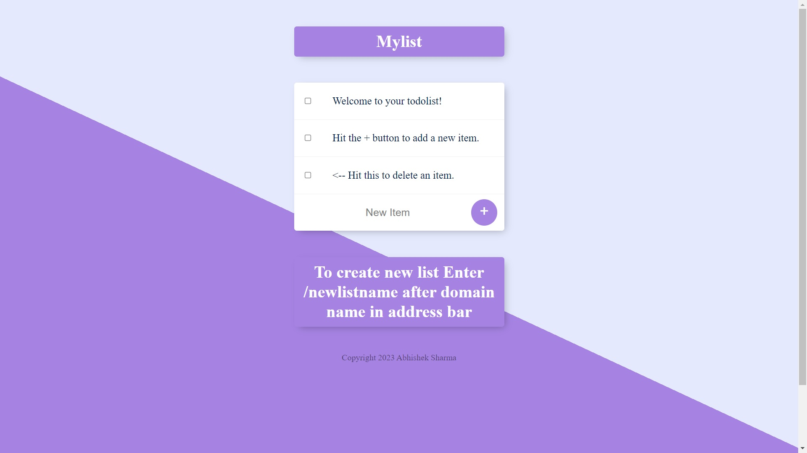

<h1 align="center">To do list</h1>

<p align="center">
</p>

<h2 align="center"><a href="https://todolist-0fjc.onrender.com/">👆 Clike here for live demo 💻</a></h2>

---

## Description

**To-do list website**

<p>This to-do list website is a dynamic site, generated using ejs template on the Nodejs environment on the backend side.<br/>
This site can be used for storing day-to-day list items based on specific list names.<br/>
This website uses all CRUD operations, all lists and list items saved in the MongoDB cloud database.
</p>

---

## Technologies used
- EJS
- NodeJs
- ExpressJs
- Mongoose
- MongoDB Atlas cloud storage

---

## FeaturesSave

- save to-do items in the list
- create list
- delete saved to-do items 

---

## Web App Installation Instructions

- Clone todo list project
- Go to the project directory

```
git clone https://github.com/abhisheksharma1310/todolist_ssr
cd todolist_ssr/
```
- Install all packages 

- Run web app

```
npm install
npm run start
```

- For build package

```
npm run build
```


